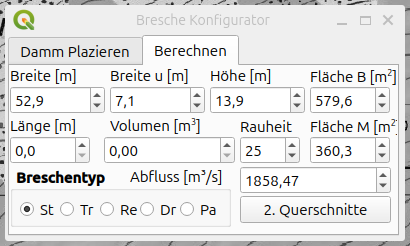
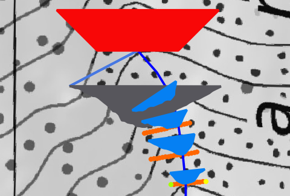
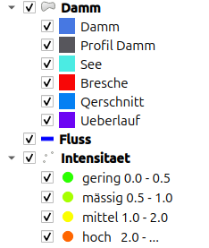
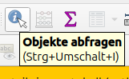

# Qgis Plugin Flutwelle  

### Vereinfachtes Verfahren zur Berechnung einer Flutwelle mit primär eindimensionaler Ausbreitung

gemäss Dokument [Hilfsmittel CTGREF Berechnung](https://www.google.com/url?sa=t&source=web&rct=j&opi=89978449&url=https://pubdb.bfe.admin.ch/de/publication/download/7496&ved=2ahUKEwjs2Ku1m9eSAxUt2gIHHYopEmsQFnoECB8QAQ&usg=AOvVaw13yYJd4Tfo0LOXmt2WQZpN)

## Installaton 
Die Überprüfung der Resultate ist durch den Benutzer vorzunehmen. Dieses Programm dient der Abschätzung der Flutwelle. Der Benutzer trägt die Verantwortung für etwaige Konsequenzen.  

Neben der Aktivierung des Plug-ins müssen die GeoTIF-Files der zu untersuchenden Region in ein Verzeichnis heruntergeladen werden. Zu finden sind die Files bei  [swissALTI3D](https://www.swisstopo.admin.ch/de/hoehenmodell-swissalti3d#swissALTI3D---Download) oder [swissSURFACE3D](https://www.swisstopo.admin.ch/de/hoehenmodell-swisssurface3d-raster) sind jedoch vorzugweise in seperate Verzeichnisse zu speichern.

## Ausführen Flutwelle
**Bitte beachte, dass aufgrund der hohen Rechenkapazität des Programms mit einer längeren Dauer für den betreffenden Prozess zu rechnen ist.**

Die Flutwelle lädt die beiden Karten „Landkarte” und „Relief” von www.swisstopo.admin.ch. Danach ist das Verzeichnis der GeoTIFF-Datei auszuwählen, sofern dies nicht bereits erledigt wurde. 

Beachte, dass die **max Flusslänge** die Distanz von der Bresche bis zum Endpunkt definiert. 
Wird "mit See" angewählt, werden die Länge und das Volumen hinter dem Damm berechnet. Andernfalls besteht die Möglichkeit, die Daten nachträglich einzugeben.

Wird der Damm ausgewählt, kann dieser gezeichnet werden. Dabei wird die Höhenlinie des Startpunkts hervorgehoben. Im nächsten Schritt werden die relevanten Daten erfasst um die Abflussbreite zu berechnen. 

In der ersten Zeile wird die Grösse der Bresche festgelegt.
In der zweiten Dimension werden die Dimensionen des Sees,sowie die Rauheit des Geländes definiert.
Zur Berechnung des Abflusses in der Bresche steht Ihnen der Breschentyp zur Verfügung. Die Wahl besteht zwischen den Breschentypen Standard, Trapez, Rechteck, Dreieck und Parabel. 

## Resultat

Mit der Option  können die berechneten Werte abgefragt werden.

