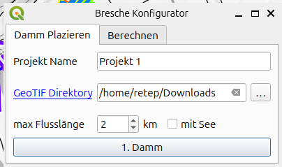
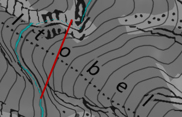

# Qgis Plugin  Flutwelle  

### Vereinfachtes Verfahren zur Berechnung einer Flutwelle mit primär eindimensionaler Ausbreitung

gemäss Dokument [Hilfsmittel CTGREF Berechnung](https://www.google.com/url?sa=t&source=web&rct=j&opi=89978449&url=https://pubdb.bfe.admin.ch/de/publication/download/7496&ved=2ahUKEwjs2Ku1m9eSAxUt2gIHHYopEmsQFnoECB8QAQ&usg=AOvVaw13yYJd4Tfo0LOXmt2WQZpN)

## Installaton 
Neben der Aktivierung des Plug-ins müssen die GeoTIF-Files der zu untersuchenden Region in ein Verzeichnis heruntergeladen werden. Zu finden sind die Files bei  [swissALTI3D](https://www.swisstopo.admin.ch/de/hoehenmodell-swissalti3d#swissALTI3D---Download) oder [swissSURFACE3D](https://www.swisstopo.admin.ch/de/hoehenmodell-swisssurface3d-raster) sind jedoch vorzugweise in seperate Verzeichnisse zu speichern.

## Ausführen Flutwelle
Die Flutwelle lädt die beiden Karten „Landkarte” und „Relief” von www.swisstopo.admin.ch. Danach ist das Verzeichnis der GeoTIFF-Datei auszuwählen, sofern dies nicht bereits erledigt wurde. 

Wird „mit See“ angewählt, werden die Länge und das Volumen hinter dem Damm berechnet. Wird „mit See“ angewählt, werden die Länge und das Volumen hinter dem Damm berechnet. Ansonsten können die Daten auch nachträglich eingegeben werden.
Wird der Damm angewählt, kann er gezeichnet werden.

